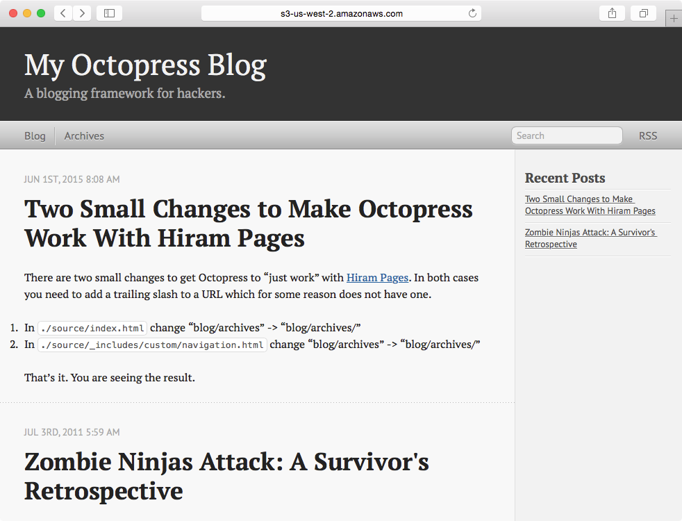
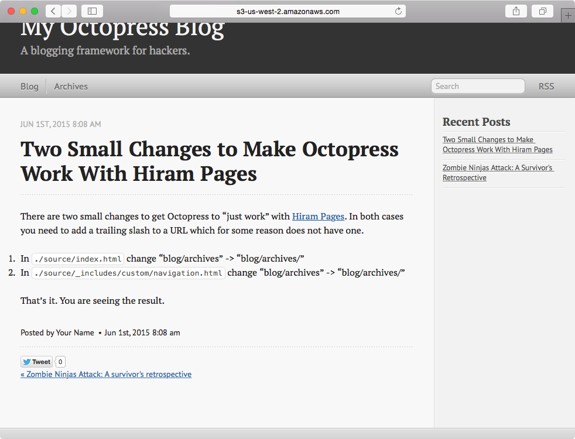
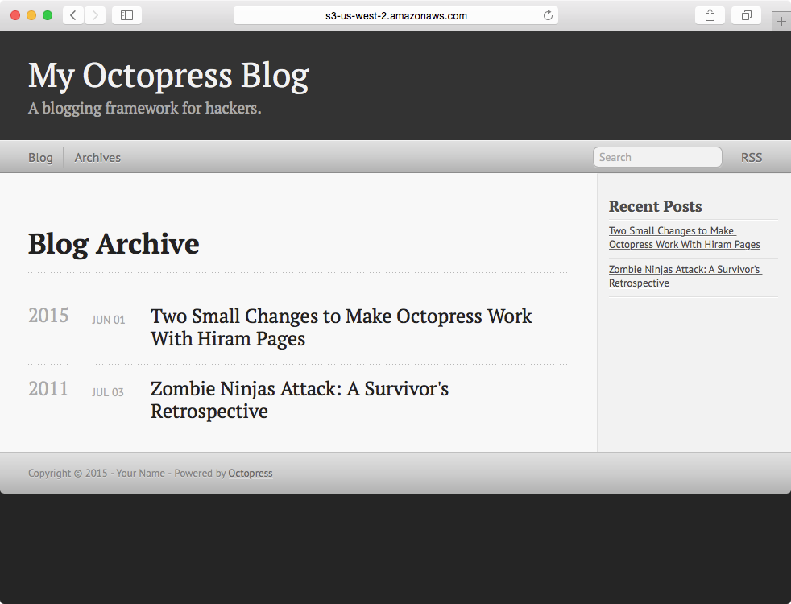

Demonstration of Octopress and Hiram Pages
=======

This fork of Octopress has a few small changes to build and publish the sample blog a [Hiram Pages](https://www.hirampages.com) Bucket.

The original project is at [https://github.com/imathis/octopress](https://github.com/imathis/octopress).

For example, it includes the [Hiram Pages Bridge](https://github.com/hiramsoft/hp-bridge) inline at *hp-bridge.html*.

How to get an Octopress blocg working in your bucket:

1. Install Jekyll and Octopress like normal
2. Install AWS CLI
3. Edit run-demo.sh use your bucket.  By default run-demo uses the sample blog made available in the *source* directory.
4. Run *run-demo.sh*
5. Go to Hiram Pages to create an "HP Bridge Static Site" link

Changes to default theme
-------

We had to make two small changes to get Octopress to work.

There are two small changes to get Octopress to "just work" with [Hiram Pages](https://www.hirampages.com).  In both cases you need to add
a trailing slash to a URL which for some reason does not have one.

1. In `./source/index.html` change "blog/archives" -> "blog/archives/"
2. In `./source/_includes/custom/navigation.html` change "blog/archives" -> "blog/archives/"

Screenshots
-------

These screenshots reflect what you should see:

When this static website is hosted on S3 and locked by Hiram Pages, only people you allow may view the blog.